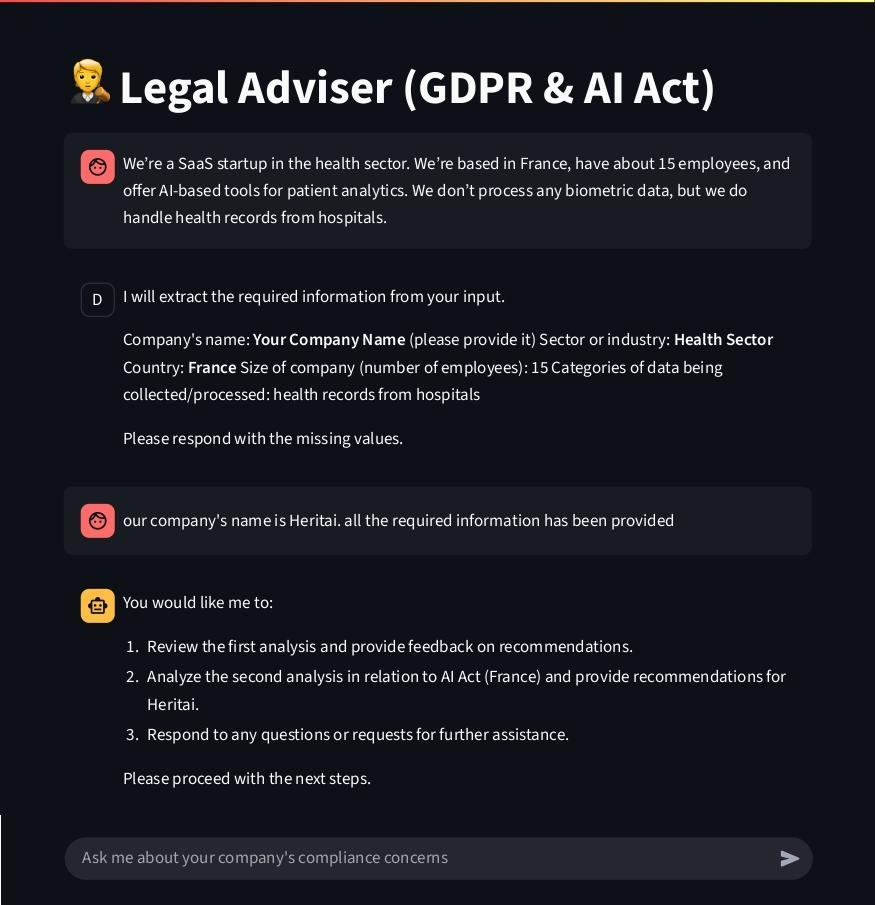

# AI Compliance Assistant 🛡️🤖

**AI Compliance Assistant** is an interactive multi-agent LLM system that helps companies assess and improve compliance with AI and data protection regulations such as the GDPR and the EU AI Act. The assistant guides users through a structured dialogue, extracts key company information, and performs document-based regulatory analysis using advanced retrieval and summarization.

---

## 🧠 Project Overview

This project uses [LangGraph](https://github.com/langchain-ai/langgraph) to orchestrate multiple specialized agents:

- **Dialogue Agent**: Interacts with users to extract company name, sector, country, size, and categories of data processed.
- **GDPR Analyst Agent**: Evaluates company practices against GDPR requirements using vector search over the official regulation text.
- **AI Act Analyst Agent**: Assesses compliance with the EU AI Act using similar retrieval and analysis.
- **Summarizer Agent**: Summarizes both GDPR and AI Act analysis and generates a single report on company's obligations and recommendations.

Agents interact in a graph-based architecture for modular, explainable, and extensible compliance analysis.

### 🖼️ Architecture

---

## 📂 Repository Structure

- `agents.py` – Defines the multi-agent workflow, agent logic, and orchestration with LangGraph.
- `utils.py` – Utilities for loading regulatory documents, creating and managing vector stores.
- `chatbot.py` – Streamlit web interface for interactive compliance conversations.
- `regulations-text/` – Contains official PDF texts of GDPR and AI Act.
- `requirements.txt` – Python dependencies.
- `README.md` – Project documentation.

---

## 🏗️ How It Works

1. **User Dialogue**: The assistant asks targeted questions to gather company details.
2. **Information Extraction**: Extracted information is validated and structured.
3. **Compliance Analysis**: The system retrieves relevant regulatory articles and generates tailored recommendations for GDPR and AI Act compliance.
4. **Summary Output**: A concise summary of obligations, risks, and recommendations is provided.

---

## 🔮 Features & Roadmap

- ✅ Local LLM support (via Ollama)
- ✅ Multi-agent workflow with LangGraph
- ✅ Regulatory document retrieval (GDPR & AI Act)
- ✅ Streamlit-based web interface
- 🔍 Symbolic rules and logic for advanced reasoning (planned)
- 🧠 Fine-tuned agents for additional domains (e.g., HIPAA) (planned)
- 💾 Persistent compliance reports (planned)
- 📚 Automatic regulatory summaries (planned)

---

## 📌 Disclaimer

This project is **under active development**. Functionality and agent capabilities are evolving. Use for educational or prototyping purposes only.

---

## 🤝 Contributing

Contributions are welcome! Please open issues or pull requests to suggest improvements or report bugs.

---

## 📫 Contact

For questions or collaboration, connect via [LinkedIn](https://www.linkedin.com/in/yousef-taheri).