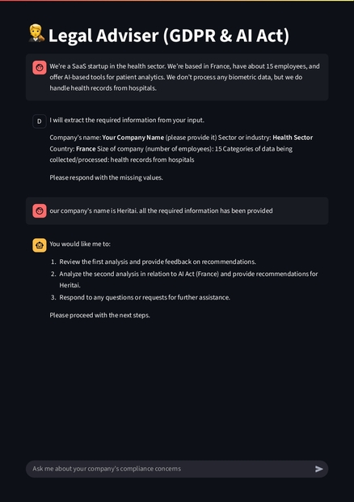
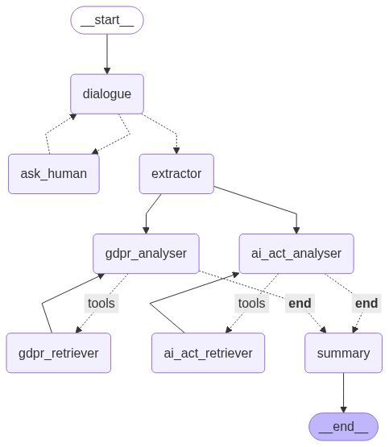

# AI Compliance Assistant 🛡️🤖

**AI Compliance Assistant** is an interactive multi-agent LLM system designed to help startups and tech companies ensure their compliance with data protection regulations such as the GDPR. By guiding users through a structured dialogue and performing document-based regulatory analysis, this project aims to make legal compliance more accessible, scalable, and intelligent.

---

## 🧠 Project Overview

The system leverages **LangGraph** to orchestrate multiple agents:

- **Dialogue Agent**: Asks a set of smart questions to gather all necessary information about the company, its data handling practices, and technologies used.
- **Compliance Analyst Agent**: Uses vector search and regulatory documents to analyze potential risks and requirements.
- **Coordinator Node**: Manages the workflow and determines when enough information has been gathered to proceed.

The agents interact in a graph-based architecture to ensure modular, flexible, and explainable AI decision-making.

---

## 📂 Repository Structure

- `agents.py` – Main orchestration logic with LangGraph, defining the flow of the multi-agent system.
- `utils.py` – Utility functions for regulatory lookup, context handling, and interfacing with the LLM.
---

## 🏗️ How It Works

1. **User Interaction**: The system engages in a Q&A-style conversation to collect structured information.
2. **Validation**: Once enough information is available, the system decides to proceed to the next phase.
3. **Compliance Evaluation**: The Analyst Agent evaluates company practices against regulatory requirements using vector store retrieval and summarization.
4. **Output**: The system provides a compliance risk overview and recommendations.

---

## 🖼️ Architecture

---

## 🔮 Planned Features

- ✅ Local LLM support (already integrated via Ollama)
- 🔍 Regulation reasoning using Symbolic Rules & Logic (future)
- 🧠 Fine-tuned agents for specialized compliance domains (e.g. AI Act, HIPAA)
- 🌐 Web-based interface using Streamlit or FastAPI
- 💾 Persistence of compliance reports in a dashboard
- 📚 Automatic summary of regulatory requirements per domain

---

## 📌 Disclaimer

This project is a **work in progress**. The current version is functional but under active development. Expect more features, better agent tuning, and integration with symbolic logic soon.

---

## 🤝 Contributions

Feel free to fork, suggest improvements, or raise issues. Compliance is complex – let’s make it simple, together.

---

## 📫 Contact

For suggestions or collaboration ideas, connect with me on [LinkedIn](https://www.linkedin.com).

